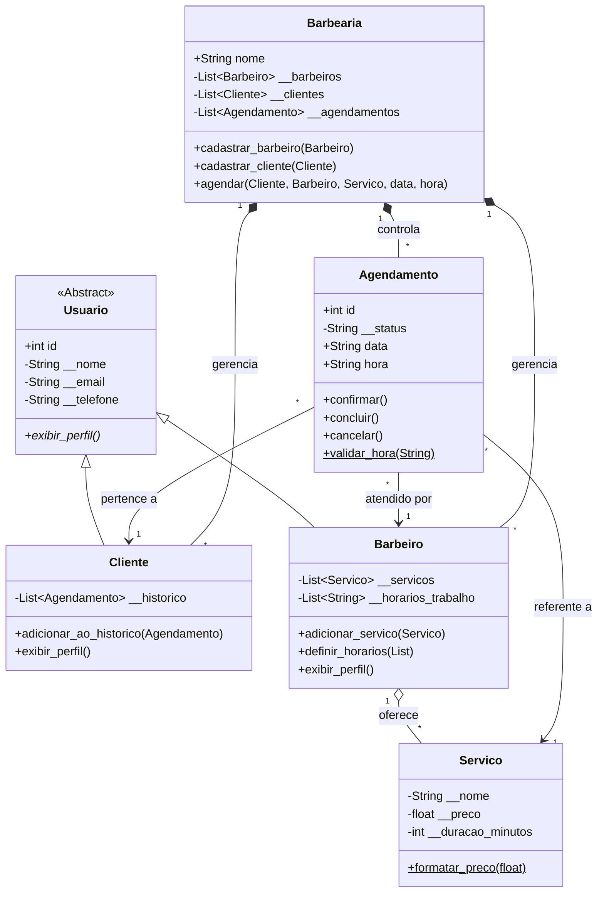

# 🎤 Roteiro de Apresentação: Projeto Cortejá

Este documento contém a divisão estruturada da apresentação do sistema **Cortejá**, focada nos conceitos de Engenharia de Software e Modelagem Orientada a Objetos. O roteiro foi pensado para otimizar o tempo e cobrir os principais requisitos da disciplina.

---

## 🧑‍🏫 Membro 1: Introdução, Escopo e Decisões de Arquitetura

**Objetivo:** Contextualizar o público (professor e turma) sobre o que é o projeto e defender a stack tecnológica escolhida.

*   **Slide 1: Capa e Tema:** Título do projeto (Cortejá), disciplina e membros do grupo.
*   **Slide 2: O Problema e a Solução:** 
    *   Explicar brevemente o que é o Cortejá (um sistema de agendamento focado em barbearias).
    *   Como a Engenharia de Software foi fundamental para mapear os requisitos e evitar um código bagunçado.
*   **Slide 3: Arquitetura e Modularidade:** 
    *   Explicar que o sistema não foi feito como um "script único".
    *   Mostrar como o código foi dividido em pacotes com alta coesão e baixo acoplamento (`usuarios`, `servicos`, `agendamentos`, `barbearia`), facilitando a manutenção e divisão de tarefas na equipe.
*   **Slide 4: Decisões Arquiteturais (Por que Python e não Java?):** 
    *   *Defesa do grupo:* "Sabemos que a orientação inicial era Java, mas escolhemos Python para focar na agilidade e legibilidade modernas."
    *   *O ponto forte:* Explicar que todos os conceitos rigorosos do Java foram adaptados. Substituíram as *Interfaces* do Java pelo módulo *ABC* (Abstract Base Classes) do Python, e os *Getters/Setters* pelo decorador *@property*. Assim, o rigor da Engenharia de Software foi mantido intacto.

---

## 🧑‍🏫 Membro 2: Modelagem Estrutural (UML e Herança)

**Objetivo:** Mostrar visualmente como o sistema foi estruturado e explicar a base da Orientação a Objetos no projeto.

*   **Slide 5: O Diagrama de Classes:** 
    *   *Neste slide, vocês devem colar a imagem gerada a partir do código Mermaid (fornecido no final deste documento).*
    *   Mostrar a visão geral do sistema e como as classes se conectam.
*   **Slide 6: Abstração e Herança:** 
    *   Explicar a Classe Abstrata `Usuario`.
    *   Falar como ela generaliza os dados comuns (nome, e-mail) e como as classes filhas `Cliente` e `Barbeiro` herdam esses atributos, evitando repetição de código.
*   **Slide 7: Polimorfismo na Prática:** 
    *   Citar o método `exibir_perfil()`.
    *   Explicar que o sistema trata ambos como "Usuários", mas graças ao Polimorfismo, o Cliente exibe seu histórico e o Barbeiro exibe seus serviços, usando exatamente o mesmo comando.

---

## 🧑‍🏫 Membro 3: Composição e Encapsulamento

**Objetivo:** Explicar como os objetos interagem entre si e como os dados são protegidos.

*   **Slide 8: Composição de Objetos:** 
    *   Explicar que um `Agendamento` não guarda apenas "textos" soltos, mas sim objetos complexos inteiros (o Cliente, o Barbeiro e o Serviço). 
    *   Mostrar como a classe `Barbearia` atua como a grande orquestradora que contém as listas de todos eles.
*   **Slide 9: Encapsulamento:** 
    *   Mostrar como o acesso aos dados foi protegido. 
    *   Dar o exemplo prático do projeto: o uso de setters (decoradores `@property`) para garantir que o sistema rejeite um serviço com "preço negativo" ou um e-mail cadastrado "sem o arroba (@)".

---

## 🧑‍🏫 Membro 4: Modelagem Comportamental (Máquina de Estados)

**Objetivo:** Demonstrar o rigor das regras de negócio aplicadas no fluxo do agendamento.

*   **Slide 10: O que é uma Máquina de Estados:** 
    *   Explicar o conceito teórico de Engenharia de Software utilizado para controlar ciclos de vida e evitar inconsistências.
*   **Slide 11: Aplicando no Agendamento:** 
    *   Mostrar como o atributo privado `__status` da classe `Agendamento` é protegido. 
    *   Explicar as regras: O sistema proíbe pular de `agendado` direto para `concluido`, ou cancelar um atendimento que já está `concluído`. Isso garante a integridade absoluta dos dados no sistema.

---

## 🧑‍🏫 Membro 5: Resiliência, Qualidade e Conclusão

**Objetivo:** Fechar a apresentação mostrando um código profissional, à prova de falhas, e anunciar o futuro do projeto.

*   **Slide 12: Tratamento de Exceções Customizadas:** 
    *   Como a equipe mapeou os erros do domínio de negócio criando classes específicas como `HorarioIndisponivelError` ou `CancelamentoInvalidoError`.
    *   Explicar que isso impede que o sistema "quebre" (crash) na tela do usuário, oferecendo mensagens amigáveis.
*   **Slide 13: Conclusão:** 
    *   Resumir como a aplicação rigorosa da Engenharia de Software e POO (Programação Orientada a Objetos) facilitou o desenvolvimento do Backend.
*   **Slide 14: Próximos Passos:** 
    *   Anunciar que o sistema atual é uma base sólida de regras de negócio prontas.
    *   Revelar que o próximo passo do grupo será construir um **protótipo visual (interface/UI)** em cima dessa estrutura perfeita.

---

## 📊 Código para o Diagrama de Classes (Mermaid)

*Para transformar este código em imagem para o slide, copie o bloco abaixo e cole no site [Mermaid Live Editor](https://mermaid.live/), depois clique em baixar como PNG ou SVG.*

